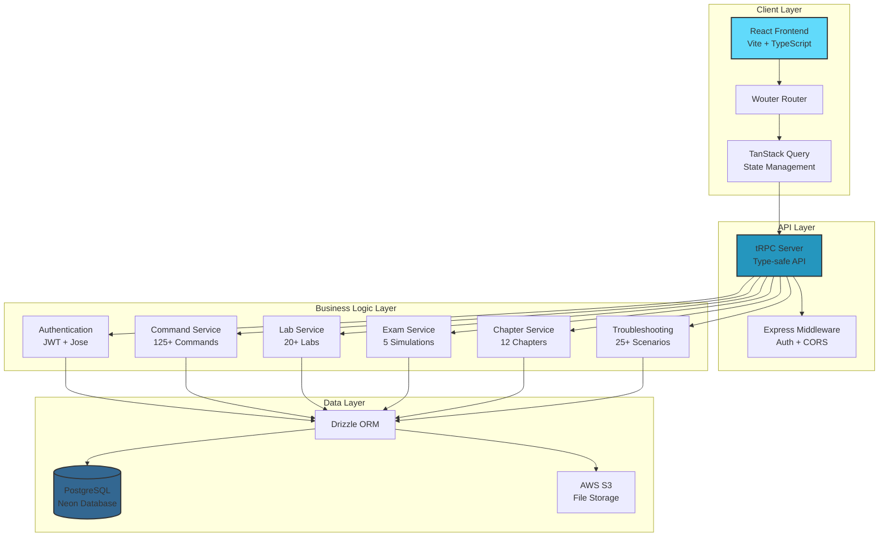
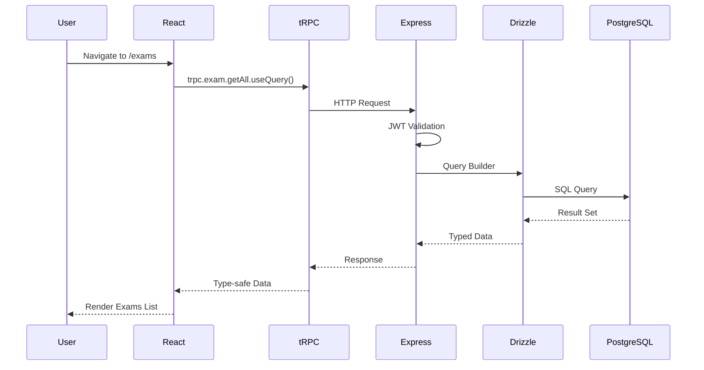
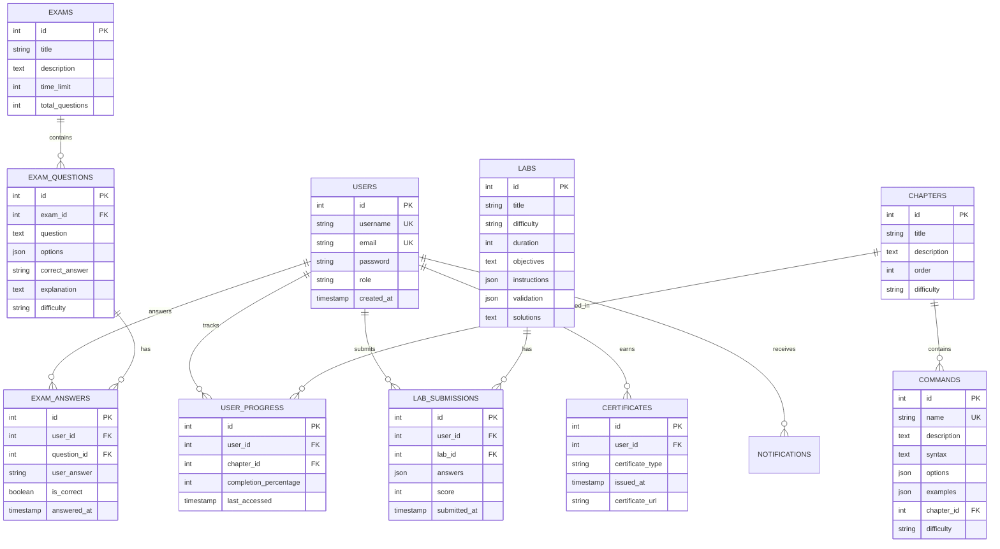
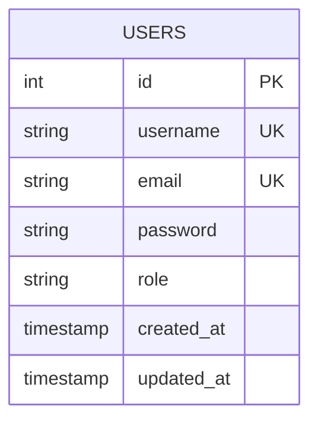
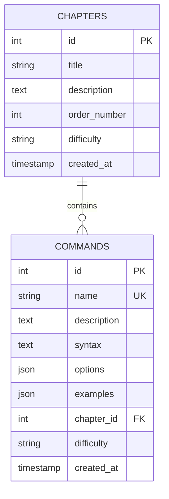
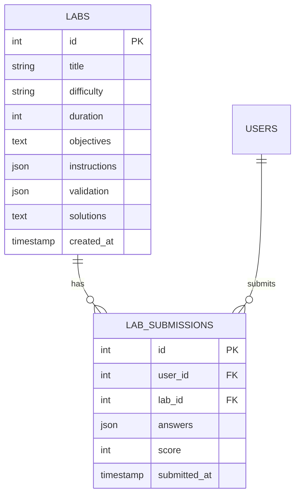
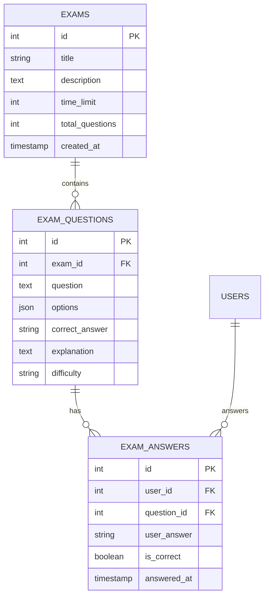
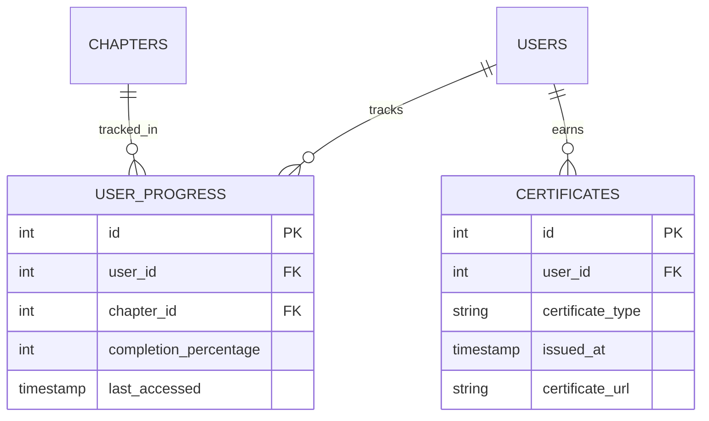

<div align="center">


## OCTUPUS Education

### RHCSA Learning Platform

<p>
  <strong>Professional RHCSA training experience for chapters, labs, exams, and command mastery.</strong>
</p>

[](https://opensource.org/licenses/MIT)
[](https://nodejs.org/)
[](https://www.typescriptlang.org/)
[](https://reactjs.org/)
[](https://neon.tech/)
[](https://pnpm.io/)

<p>
  A comprehensive full-stack platform for Red Hat Certified System Administrator (RHCSA) preparation.
</p>

[Features](#-features) • [Tech Stack](#-tech-stack) • [Getting Started](#-getting-started) • [Documentation](#-documentation) • [License](#-license)

</div>

---

## 📋 Table of Contents

- [Overview](#-overview)
- [Features](#-features)
- [Tech Stack](#-tech-stack)
- [Architecture](#-architecture)
- [Getting Started](#-getting-started)
- [Project Structure](#-project-structure)
- [API Documentation](#-api-documentation)
- [Database Schema](#-database-schema)
- [Roadmap](#-roadmap)
- [License](#-license)

---

## 🎯 Overview

**OCTOPUS Education** is a modern, interactive learning platform designed specifically for individuals preparing for the **Red Hat Certified System Administrator (RHCSA)** certification. The platform provides structured learning paths, hands-on labs, comprehensive command references, and realistic exam simulations.

### 🎓 What You'll Learn

- 12 comprehensive chapters covering all RHCSA exam objectives
- 125+ essential Linux commands with detailed syntax and examples
- 18 progressive labs (Easy → Medium → Hard)
- 5 practice exams with multiple-choice questions
- Interactive Linux terminal for hands-on practice
- AI-powered assistant for troubleshooting and learning
- Performance tracking and progress monitoring

---

## ✨ Features

### 📚 **Structured Learning**

- **12 Comprehensive Chapters**: From system administration fundamentals to advanced troubleshooting
- **Chapter-based Content**: Organized learning paths aligned with RHCSA exam objectives
- **Progressive Difficulty**: Content structured from beginner to advanced levels

### 💻 **Command Reference Database**

- **125+ Linux Commands**: Complete documentation for essential RHCSA commands
- **Detailed Syntax**: Comprehensive syntax, options, and parameters
- **Real-world Examples**: Practical usage examples with expected outputs
- **Search & Filter**: Quick command lookup and category filtering

### 🧪 **Interactive Labs**

- **18 Hands-on Labs**: Progressive difficulty from easy to hard
- **QCM Format**: Multiple-choice questions with immediate feedback
- **Step-by-step Instructions**: Guided exercises with clear objectives
- **Completion Tracking**: Track finished labs and review solutions

### 📝 **Exam Practice**

- **5 Practice Exams**: Multiple-choice questions covering RHCSA topics
- **Question Bank**: Access to comprehensive exam questions
- **Instant Feedback**: Detailed explanations for answers
- **Progress Tracking**: Review your exam history and scores

### 🤖 **AI Assistant (OCTOPUS)**

- **Expert Guidance**: AI-powered RHCSA assistant for troubleshooting
- **Real-time Help**: Get instant answers to Linux administration questions
- **Command Explanations**: Detailed breakdowns of command syntax and usage
- **Best Practices**: Learn industry-standard approaches to system administration

### 📊 **Progress Tracking**

- **User Dashboards**: Personal progress visualization
- **Chapter Completion**: Track learning progress by chapter
- **Lab Submissions**: Monitor lab completion and scores
- **Exam History**: Review past exam attempts and scores

### 📄 **PDF Exports**

- **Cheatsheets**: Downloadable reference guides per chapter
- **Certificates**: Completion certificates for finished courses
- **Custom Reports**: Generate learning progress reports

### 🌍 **Internationalization**

- **Bilingual Support**: Full English and French translations
- **Easy Language Switch**: Toggle between languages seamlessly
- **Localized Content**: All features available in both languages

---

## 🛠️ Tech Stack

### **Frontend**

| Technology                                                                               | Version  | Purpose           |
| ---------------------------------------------------------------------------------------- | -------- | ----------------- |
|                     | 19.2.1   | UI Library        |
|       | 5.9.3    | Type Safety       |
|                         | 7.1.7    | Build Tool        |
|     | 4.1.14   | Styling           |
|                          | Latest   | Component Library |
|                               | 3.3.5    | Routing           |
|  | 12.23.22 | Animations        |
|              | 5.90.2   | Data Fetching     |

### **Backend**

| Technology                                                                          | Version | Purpose           |
| ----------------------------------------------------------------------------------- | ------- | ----------------- |
|             | 22+     | Runtime           |
|          | 4.21.2  | Web Framework     |
|                   | 11.6.0  | Type-safe API     |
|                               | 4.1.12  | Schema Validation |
|  | 0.44.5  | Database ORM      |
|   | Neon    | Database          |

### **Development Tools**

| Tool                                                                          | Version | Purpose             |
| ----------------------------------------------------------------------------- | ------- | ------------------- |
|             | 10.4.1  | Package Manager     |
|    | 0.25.0  | Bundler             |
|        | 2.1.4   | Testing Framework   |
|  | 3.6.2   | Code Formatter      |
|                         | 4.19.1  | TypeScript Executor |

---

## 🏗️ Architecture

### System Architecture Diagram



### Data Flow Diagram



### Database Entity Relationship Diagram



---

## 🚀 Getting Started

### Prerequisites

Before you begin, ensure you have the following installed:

- **Node.js** 22.0.0 or higher ([Download](https://nodejs.org/))
- **pnpm** 10.0.0 or higher ([Installation Guide](https://pnpm.io/installation))
- **PostgreSQL** database (recommend [Neon](https://neon.tech/) for serverless PostgreSQL)
- **Git** ([Download](https://git-scm.com/downloads))

### 🌐 Live Demo

Experience the platform live — no installation required:

**[🚀 Try OCTUPUS Education → octupus-education.onrender.com](https://octupus-education.onrender.com)**

> **Note:** The live demo is hosted on Render's free tier. The first load may take 30–60 seconds to spin up the server.

---

## 📁 Project Structure

```
rhcsa-learning/
│
├── client/                      # React frontend application
│   ├── public/                  # Static assets
│   ├── src/
│   │   ├── _core/              # Core utilities and configurations
│   │   ├── components/         # Reusable React components
│   │   │   ├── ui/            # Radix UI components
│   │   │   ├── layout/        # Layout components
│   │   │   └── features/      # Feature-specific components
│   │   ├── contexts/          # React contexts for state management
│   │   ├── hooks/             # Custom React hooks
│   │   ├── lib/               # Utility libraries
│   │   ├── locales/           # i18n translation files
│   │   │   ├── en.json       # English translations
│   │   │   └── fr.json       # French translations
│   │   ├── pages/            # Page components (routes)
│   │   ├── App.tsx           # Root application component
│   │   ├── main.tsx          # Application entry point
│   │   └── index.css         # Global styles
│   └── index.html            # HTML template
│
├── server/                    # Express + tRPC backend
│   ├── _core/                # Core server files
│   │   ├── index.ts         # Server entry point
│   │   └── trpc.ts          # tRPC configuration
│   ├── routers.ts           # tRPC router definitions
│   ├── db.ts                # Database connection and schema
│   ├── data.ts              # Seed data definitions
│   ├── storage.ts           # AWS S3 file storage utilities
│   ├── seed-neon.ts         # Neon database seeder
│   └── seed-demo-data.mjs   # Demo data seeder
│
├── shared/                   # Shared code between client and server
│   ├── types/               # TypeScript type definitions
│   └── constants/           # Shared constants
│
├── drizzle/                 # Database migrations and metadata
│   ├── meta/               # Migration metadata
│   └── migrations/         # SQL migration files
│
├── dist/                    # Production build output
│
├── patches/                 # pnpm package patches
│
├── .env                     # Environment variables (create this)
├── .gitignore              # Git ignore rules
├── .prettierrc             # Prettier configuration
├── components.json         # shadcn/ui configuration
├── drizzle.config.ts       # Drizzle ORM configuration
├── package.json            # Project dependencies and scripts
├── pnpm-lock.yaml          # pnpm lock file
├── tsconfig.json           # TypeScript configuration
├── vite.config.ts          # Vite configuration
├── vitest.config.ts        # Vitest configuration
├── README.md               # This file
└── LICENSE                 # MIT License
```

---

## 📡 API Documentation

### tRPC Routers

The application uses **tRPC** for type-safe API communication. All routes are defined in `server/routers.ts`.

#### Authentication (OAuth-based)

```typescript
// Get Current User
trpc.auth.me.query()

// Update Profile
trpc.auth.updateProfile.mutate({ name: string, email?: string })

// Logout
trpc.auth.logout.mutate()

// Authentication Flow
// - OAuth providers: Google, GitHub
// - Local authentication: /api/oauth/local (email-based)
// - Session management via JWT tokens
```

#### Chapters Router

```typescript
// Get All Chapters
trpc.chapters.getAll.query();

// Get Chapter by ID
trpc.chapters.getById.query({ id: number });

// Get User Progress
trpc.chapters.getProgress.query({ userId: number });

// Update Progress
trpc.chapters.updateProgress.mutate({
  chapterId: number,
  completionPercentage: number,
});
```

#### Commands Router

```typescript
// Get All Commands
trpc.commands.getAll.query();

// Search Commands
trpc.commands.search.query({ query: string });

// Filter by Chapter
trpc.commands.getByChapter.query({ chapterId: number });

// Get Command Details
trpc.commands.getById.query({ id: number });
```

#### Labs Router

```typescript
// Get All Labs
trpc.labs.getAll.query();

// Get Lab by ID with Questions
trpc.labs.getById.query({ id: number });

// Complete Lab
trpc.progress.completeLab.mutate({ labId: number });

// Get Lab Completion Status
trpc.progress.getLabStatuses.query();
```

#### Exams Router

```typescript
// Get All Exams
trpc.exams.getAll.query();

// Get Exam Questions
trpc.exams.getQuestions.query({ examId: number });

// Submit Exam Result
trpc.progress.submitExamResult.mutate({
  examId: number,
  score: number,
  passed: boolean,
});

// Get Exam Results History
trpc.progress.getExamStatuses.query();
```

---

## 🗄️ Database Schema

The following diagrams detail each table's structure individually for clarity.

### users



### chapters & commands



### labs & submissions



### exams & questions



### progress & certificates



---

## 🗺️ Roadmap

### 🚀 Current Platform (Available Now)

OCTOPUS Education is already a fully functional RHCSA learning platform with:

- ✅ OAuth authentication (Google, GitHub, Local)
- ✅ 12 structured learning chapters
- ✅ 125+ Linux commands with search
- ✅ 18 interactive labs (QCM format)
- ✅ Practice exams with question banks
- ✅ Interactive terminal environment
- ✅ Progress tracking dashboard
- ✅ AI assistant for guidance
- ✅ Bilingual support (EN/FR)
- ✅ PDF exports (cheatsheets & certificates)

---

### 🚧 Continuous Improvements

We are actively enhancing the platform with:

- Advanced lab validation system
- Real-time exam simulation with timer
- Detailed analytics dashboard

---

### 📅 Upcoming Features

- 🎯 Smart AI hints based on your progress
- 🎥 Video tutorials for chapters and labs
- 💬 Community discussions and support
- 🧩 Real-world troubleshooting scenarios
- 🏅 Gamification system (badges & achievements)
- 👥 Collaborative learning features

---

### 🔮 Future Vision

- Mobile application
- Offline learning mode
- Instructor / Admin dashboard
- Third-party integrations (GitHub, LinkedIn)
- Expansion to new certifications

---

> OCTOPUS Education is actively evolving — and this is just the beginning.

## 🎓 Certifications

OCTOPUS Education is continuously evolving.

We will be adding new certifications progressively to expand the platform and cover more domains in system administration, cloud, and cybersecurity.

🚀 Our goal is to build a unified learning ecosystem where you can prepare for multiple certifications in one place.

💡 We are also open to your suggestions — feel free to share which certifications you'd like to see next!

> Your feedback helps shape the future of OCTOPUS Education.

## 🔒 Security

### Security Measures

- OAuth 2.0 authentication with JWT session tokens
- Secure session management with jose library
- SQL injection prevention via parameterized queries (Drizzle ORM)
- CORS configuration for API security
- Protected tRPC procedures for authenticated routes
- Environment variable protection
- HTTPS in production
- Container isolation for terminal execution

---

## 📄 License

This project is licensed under the **MIT License** - see the [LICENSE](LICENSE) file for details.

```
MIT License

Copyright (c) 2026 OCTOPUS Education

Permission is hereby granted, free of charge, to any person obtaining a copy
of this software and associated documentation files (the "Software"), to deal
in the Software without restriction, including without limitation the rights
to use, copy, modify, merge, publish, distribute, sublicense, and/or sell
copies of the Software, and to permit persons to whom the Software is
furnished to do so, subject to the following conditions:

The above copyright notice and this permission notice shall be included in all
copies or substantial portions of the Software.

THE SOFTWARE IS PROVIDED "AS IS", WITHOUT WARRANTY OF ANY KIND, EXPRESS OR
IMPLIED, INCLUDING BUT NOT LIMITED TO THE WARRANTIES OF MERCHANTABILITY,
FITNESS FOR A PARTICULAR PURPOSE AND NONINFRINGEMENT. IN NO EVENT SHALL THE
AUTHORS OR COPYRIGHT HOLDERS BE LIABLE FOR ANY CLAIM, DAMAGES OR OTHER
LIABILITY, WHETHER IN AN ACTION OF CONTRACT, TORT OR OTHERWISE, ARISING FROM,
OUT OF OR IN CONNECTION WITH THE SOFTWARE OR THE USE OR OTHER DEALINGS IN THE
SOFTWARE.
```

---

## 🙏 Acknowledgments

- **Red Hat** for the RHCSA certification program
- **Neon** for serverless PostgreSQL hosting
- **Vercel** for the amazing development tools (tRPC, Next.js concepts)
- **Open Source Community** for the incredible tools and libraries

---

## 📞 Contact & Support

Have questions, feedback, or collaboration ideas? Feel free to reach out:

- 📧 **Email**: mustaphaamintbini@gmail.com
- 💼 **LinkedIn**: [https://www.linkedin.com/in/mustapha-amin-tbini ](https://www.linkedin.com/in/mustapha-amin-tbini/)
- 💬 **WhatsApp**: +216 46-345-226

---

> We usually respond within 24 hours.
---

## 📈 Project Stats


---

<div align="center">

**Made by the OCTOPUS Education Team**

[⬆ Back to Top](#-octopus-education)

</div>
